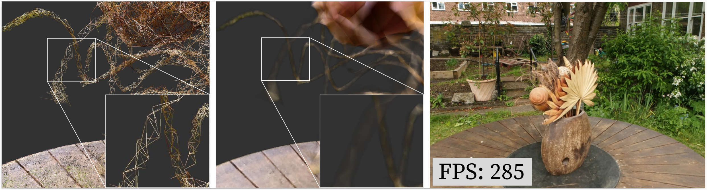

# Radiance Meshes for Volumetric Reconstruction
This is the training code for Radiance Meshes. The viewing code is [here](https://github.com/half-potato/vkrm) and the web viewer source code [here](https://github.com/half-potato/webrm).



Datasets:
[mipnerf360pt1](http://storage.googleapis.com/gresearch/refraw360/360_v2.zip), 
[mipnerf360pt2](https://storage.googleapis.com/gresearch/refraw360/360_extra_scenes.zip), 
[zipnerf](https://smerf-3d.github.io/)

More details can be found on our [website](https://half-potato.gitlab.io/rm/)

# Requirements
- NVIDIA GPU with 24GB or less of VRAM. Settings can be adjusted for lower amounts of VRAM. Reduce `--log2_hashmap_size`.
- Training code has only been tested on Linux. `uv` is known to have issues on Windows.

# Install
Install UV [here](https://github.com/astral-sh/uv).
```
uv pip install setuptools
uv pip install torch
```
Dependencies:
Then, it is as simple as running the command `uv run` instead of python to run the code. It installs everything super quickly.
For the first run, you must use the flag `uv run --no-build-isolation`
Example running command for bonsai:
```
PYTORCH_CUDA_ALLOC_CONF=expandable_segments:True uv run train.py --eval  --dataset_path /data/nerf_datasets/360/bonsai --image_folder images_2 --output_path output/bonsai
```

# Training for the web
To obtain a reduced model for mobile viewing, we recommend the following parameters:
 - `--within_thresh 4` Turns down the effective resolution of the densification
 - `--total_thresh 15` Turns down the effective resolution of the densification, but for thin structures
 - `--budget 250000` Limits the number of vertices to 250,000
 - `--voxel_size 0.1` Strongly reduces the number of initial vertices
 - `--iterations 10000` Train for a shorter amount of time
 - `--freeze_start 8000` Freeze earlier to reflect shorter training time
 - `--alpha_threshold 0 --density_threshold 0` For underwater scenes
 
 # Fisheye Lenses
Fisheye rendering is supported, fisheye training "works" but something seems a little wrong with the quality.

# Ray tracing
Ray tracing is just a few steps away from being differentiable. Should speed up training.
 
 # Training on new Scenes
Put your set of images into a folder named `$DATASET/input`. Then run
```
python convert.py -s $DATASET --resize
```
Alternatively, you can use the `Export for Gaussian Splatting` option in Agisoft Metashape, as we use the same dataset format.
Finally, you can train using the following command
```
PYTORCH_CUDA_ALLOC_CONF=expandable_segments:True uv run train.py --dataset_path $DATASET --image_folder images_4 --output_path output/my_dataset
```

# Mesh extraction
Example command:
```
uv run extract_mesh.py --output_path output/bicycle_ifimages_4_r41 --dataset_path /data/nerf_datasets/360/bicycle --contrib_threshold 0.45 
```
`--contrib_threshold` is the threshold at which a cell is added to the mesh. The resulting `.ply` files can be viewed with color in Blender. I have provided the `scripts/base.blend` with shaders that will colorize the mesh. To use it, import the ply file into the `base.blend` file, then adjust the material to the existing one.

# Benchmarking
To run our method on all datasets, you can edit the `scripts/run_full.csv` file to change the dataset paths, then run:
```
python hyperparam.py  --queue_csv scripts/run_full.csv --output_csv results/run_full_r46.csv --gpus 1,2,3 --suffix _r46
```
This is a general purpose script for running and collecting results across different parameters.

# Other Use
For training various extensions, the parameter `additional_attr` can be used. This will then get rendered out to the `'aux'` channel. Right now, the alpha channel is not trained using the aux channel.

# Licensing
The `data/colmap_loader.py` contains a minor amount of 3DGS code. Should be trivial to replace.
